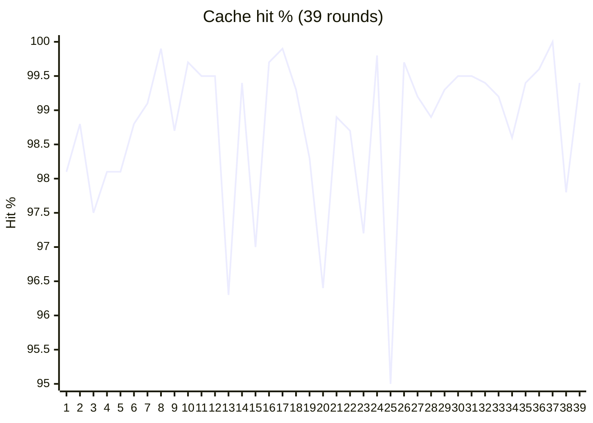

# Supported models

phi talks to LLMs through an **explicit** `api` field on each config entry
(`OpenAI` | `OpenAIResponses` | `Anthropic` | `Gemini`). Empty `api` means
OpenAI-compatible `/chat/completions`. There is no name- or URL-based
provider guessing.

Built-in **presets** (exact `name` match) fill `base_url`, `context_window`,
`image_enabled`, `api`, and default thinking when those fields are omitted.
Source of truth: [`internal/project/model`](../internal/project/model/).

## Built-in presets

| Name | API | Base URL (default) | Context | Images | Thinking wire |
| ---- | --- | ------------------ | ------: | :----: | ------------- |
| `gpt-6-astra` | OpenAIResponses | `https://api.openai.com/v1` | 272K | yes | `reasoning.effort` (max) |
| `gpt-5.6-sol` | OpenAIResponses | `https://api.openai.com/v1` | 272K | yes | `reasoning.effort` (high) |
| `gpt-5.6-terra` | OpenAIResponses | `https://api.openai.com/v1` | 272K | yes | `reasoning.effort` (high) |
| `gpt-5.6-luna` | OpenAIResponses | `https://api.openai.com/v1` | 272K | yes | `reasoning.effort` (high) |
| `gpt-5-chat-latest` | OpenAIResponses | `https://api.openai.com/v1` | 128K | yes | — |
| `gpt-5.5` | OpenAIResponses | `https://api.openai.com/v1` | 272K | yes | `reasoning.effort` (high) |
| `gpt-5.5-pro` | OpenAIResponses | `https://api.openai.com/v1` | 1.05M | yes | `reasoning.effort` (high) |
| `deepseek-flash` | OpenAI | `https://api.deepseek.com` | 1M | yes | `extra_body.thinking` + `reasoning_effort` |
| `deepseek-v4-pro` | OpenAI | `https://api.deepseek.com` | 1M | no | same as Flash |
| `gemini-2.5-pro` | Gemini | Google Generative Language | 1M | yes | `thinkingBudget` (token cap) |
| `gemini-2.5-flash` | Gemini | Google Generative Language | 1M | yes | `thinkingBudget` |
| `gemini-3-pro` | Gemini | Google Generative Language | 1M | yes | `thinkingLevel` (off floor `LOW`) |
| `gemini-3-flash` | Gemini | Google Generative Language | 1M | yes | `thinkingLevel` (off floor `MINIMAL`) |
| `kimi-k3` | OpenAI | `https://api.moonshot.cn/v1` | 1M | yes | `reasoning_effort` (max) |
| `kimi-k2.7-code` | OpenAI | `https://api.moonshot.cn/v1` | 10M | yes | — |
| `glm-5.3` | OpenAI | `https://api.z.ai/api/coding/paas/v4` | 1M | no | `extra_body.thinking` + `reasoning_effort` |
| `glm-5.3-flash` | OpenAI | `https://api.z.ai/api/coding/paas/v4` | 1M | yes | same as `glm-5.3` |

Minimal config for a preset (api key only):

```yaml
models:
  - name: deepseek-flash
    api_key: sk-...
    default: true
```

## Recommended: DeepSeek Flash

`deepseek-flash` is the preset to use for long agent sessions: 1M context, image
input, and prefix caching that holds up as the transcript grows. Only `name` and
`api_key` are required.

Measured over 39 LLM rounds of one session — prompt **16k → 40k** — cache hit
**95–100%** (avg **98.7%**):

| Round | Prompt tokens | Cached tokens | Cache hit |
| ---: | ---: | ---: | ---: |
| 1 | 16,176 | 15,872 | **98.1%** |
| 10 | 20,163 | 20,096 | **99.7%** |
| 20 | 27,604 | 26,624 | **96.4%** |
| 30 | 35,245 | 35,072 | **99.5%** |
| 39 | 39,794 | 39,552 | **99.4%** |



## Other / custom models

Any other `name` works as a normal entry. Set fields yourself:

```yaml
models:
  - name: gpt-5
    api: OpenAIResponses        # /v1/responses (not chat-completions)
    api_key: sk-...
    base_url: https://api.openai.com/v1
    context_window: 272000
    default: true

  - name: gpt-4o
    api: OpenAI                 # optional; default
    api_key: sk-...
    base_url: https://api.openai.com/v1
    context_window: 128000

  - name: claude-sonnet-4-20250514
    api: Anthropic              # required for Anthropic Messages API
    api_key: sk-ant-...
    base_url: https://api.anthropic.com
    context_window: 200000

  - name: my-proxy-model
    api: OpenAI
    api_key: ...
    base_url: https://proxy.example/v1
```

`OpenAIResponses` uses the Responses wire format (`input` items, typed SSE
events, flat function tools). Tool call IDs are stored as `call_id|item_id`
when the stream provides both, matching round-trip needs for
`function_call_output`.
Gemini without a preset name still needs `api: Gemini` and a valid base URL;
thinking then uses the budget style by default.

## Thinking level

Provider-agnostic knobs on each model (and session UI):

| Key / env | Meaning |
| --------- | ------- |
| `think_enabled` | bool; enable reasoning payload |
| `think_level` | `off` \| `minimal` \| `low` \| `medium` \| `high` \| `xhigh` \| `max` |
| `PHI_THINK_LEVEL` | env override on the default model (`off` disables) |

How that maps on the wire depends on the provider / preset interceptor
(OpenAI `reasoning_effort`, Anthropic thinking budget, Gemini budget or level).

```yaml
models:
  - name: gemini-2.5-flash
    api_key: ...
    think_level: medium
```

## Related

- Config overview: [README § Configuration](../README.md#configuration)
- Preset code: `internal/project/model/`
